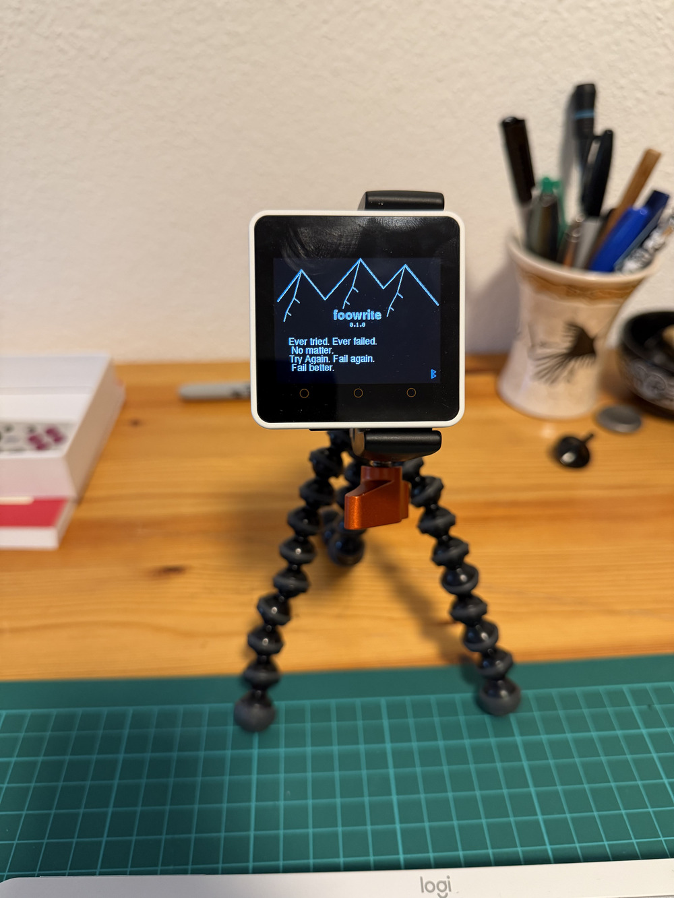

# foowrite-core2

Vim-like editor for the M5Stack Core2 and Waveshare ESP32-S3-Touch-LCD-3.49,
built with ESP-IDF (native C/C++).

Straight port (via Claude and Gemini) of the original [foowrite](https://github.com/rberenguel/foowrite) I wrote for the Pi Pico.



## Hardware

**M5Stack Core2** (default build)
- ESP32, ILI9342C 320×240 display, AXP192 PMU
- Bluetooth LE keyboard (pairs with any HID keyboard on boot)
- Micro-SD card for file storage

**Waveshare ESP32-S3-Touch-LCD-3.49**
- ESP32-S3, AXS15231B 640×172 QSPI display
- Bluetooth LE keyboard
- Micro-SD card for file storage
- Side-mounted power button (1 s hold = power off)

## Installing a pre-built release

Download the correct binary for your board from the [Releases](../../releases)
page, then flash it with [esptool](https://github.com/espressif/esptool) — no
ESP-IDF required.

| Board | Binary | `--chip` |
|---|---|---|
| M5Stack Core2 | `foowrite-core2-VERSION-core2.bin` | `esp32` |
| Waveshare ESP32-S3-Touch-LCD-3.49 | `foowrite-core2-VERSION-waveshare349.bin` | `esp32s3` |

**1. Install esptool**

```bash
pip install esptool
```

**2. Find the serial port**

Plug in the device via USB-C, then:

```bash
# macOS
ls /dev/cu.usbserial-*

# Linux
ls /dev/ttyUSB*
```

**3. Flash**

```bash
# M5Stack Core2
esptool.py --chip esp32 --port /dev/cu.usbserial-XXXX \
  --baud 921600 write_flash 0x0 foowrite-core2-VERSION-core2.bin

# Waveshare ESP32-S3-Touch-LCD-3.49
esptool.py --chip esp32s3 --port /dev/cu.usbserial-XXXX \
  --baud 921600 write_flash 0x0 foowrite-core2-VERSION-waveshare349.bin
```

Replace `/dev/cu.usbserial-XXXX` with the port found above and `VERSION` with
the release you downloaded.  The device will reboot into foowrite immediately
after flashing.

---

## Building from source

### Toolchain setup (macOS, one-time)

```bash
brew install cmake ninja dfu-util ccache
```

```bash
mkdir -p ~/esp && cd ~/esp
git clone -b v5.3.5 --recursive https://github.com/espressif/esp-idf.git
cd esp-idf && ./install.sh esp32
```

Add to `~/.zshrc` for convenience:

```zsh
alias get_idf='. ~/esp/esp-idf/export.sh'
```

### Build

```bash
get_idf   # activate ESP-IDF environment
cd /path/to/foowrite-core2
idf.py set-target esp32   # only needed once
idf.py build
```

### Flash (with IDF)

```bash
idf.py -p /dev/cu.usbserial-XXXX flash monitor
```

### Create a release binary

```bash
./release.sh              # build both board variants
./release.sh core2        # build only Core2 variant
./release.sh waveshare349 # build only Waveshare variant
```

Binaries are written to `~/Downloads/`.  The script builds each variant in a
separate directory (`build/` and `build_waveshare349/`) so you can switch
between them without a clean rebuild.

### Run tests (host, no device needed)

```bash
cd tests && cmake -B build && cmake --build build && ctest --test-dir build
```

## Battery indicator

The battery percentage is shown in two places:

**Splash screen** (top-right corner) — displayed before BLE scanning starts, so the
load is lower and the reading is closer to true state of charge.

**Status bar** (bottom-right, visible while editing) — displayed under full load
(ESP32 + BLE + display), so the reading is typically 10–15% lower than actual.

| Appearance | Meaning |
|------------|---------|
| `82%` green | Charging via USB |
| `~82%` white/grey | On battery, reading is approximate (`~` = under load) |
| `~18%` red | Low battery: ≤ 20% in editor (under load), ≤ 30% on splash |

The voltage-based percentage is a linear approximation of the LiPo discharge curve
and is inherently noisy under varying load.  Use the splash screen value (power on
without connecting the keyboard) for the most consistent readings when tracking
battery drain over time.  Power off via `:qq` or a long press of the physical button.

---

## Project structure

```
foowrite-core2/
├── main/
│   ├── main.cpp          # Entry point, BLE + editor loop
│   ├── editor.h/cpp      # Vim-like editor core
│   ├── output.hpp/cpp    # LovyanGFX display renderer
│   ├── keymap.h/cpp      # Colemak / QWERTY HID keymap
│   ├── axp192.h/cpp      # AXP192 PMU (backlight, battery, power-off)
│   ├── sd_storage.h/cpp  # SD card save / load / config
│   ├── splash.h/cpp      # Generative mountains splash screen
│   ├── version.h         # FOOWRITE_VERSION string
│   └── lgfx_config.h     # LovyanGFX display configuration
├── tests/                # Host-side Google Test suite
├── release.sh            # Produces merged flash binary for distribution
└── components/
    └── LovyanGFX/        # Display library (git submodule)
```
